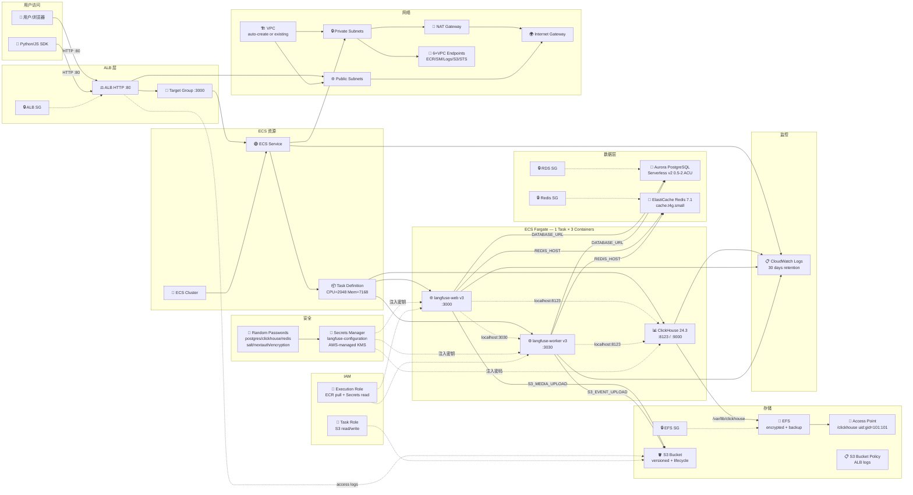

# 新项目架构（Langfuse ECS Fargate）

## 服务统计（45 个 Terraform Resource）

| 类别 | 数量 | 服务 |
|------|------|------|
| 计算 | 4 | ECS Cluster, Service, TaskDef, 3容器(1个定义) |
| 网络 | 12 | VPC, Private/Public Subnets, NAT, IGW, ALB, TG, ALB SG, 6×VPCE |
| 数据库 | 4 | Aurora Cluster, Aurora Instance, RDS SG, Redis Cluster, Redis SG |
| 存储 | 7 | EFS, EFS AP, EFS MT×2, EFS SG, S3, S3 Policy, S3 Lifecycle |
| 安全 | 6 | Secrets Manager, Random×3(pw), Random×3(bytes), ECS SG, VPCE SG |
| IAM | 2 | Execution Role, Task Role |
| 监控 | 1 | CloudWatch Log Group |
| **合计** | **~45** | |

## 与旧项目对比

| 维度 | 旧项目 | 新项目 |
|------|--------|--------|
| 总 Resource 数 | ~55 | ~45 |
| 代码文件 | ~45 | 17 |
| 外部依赖 | 5+ | 0 |
| 容器架构 | 独立 Service per Container | 3 in 1 Task |
| 数据库 | 传统 RDS | Aurora Serverless v2 |
| 部署 | GitHub Actions ×6 | `terraform apply` |
| 认证 | Azure AD OIDC | Langfuse 内置 |
| 中国区兼容 | 不支持 | 改镜像地址即可 |
