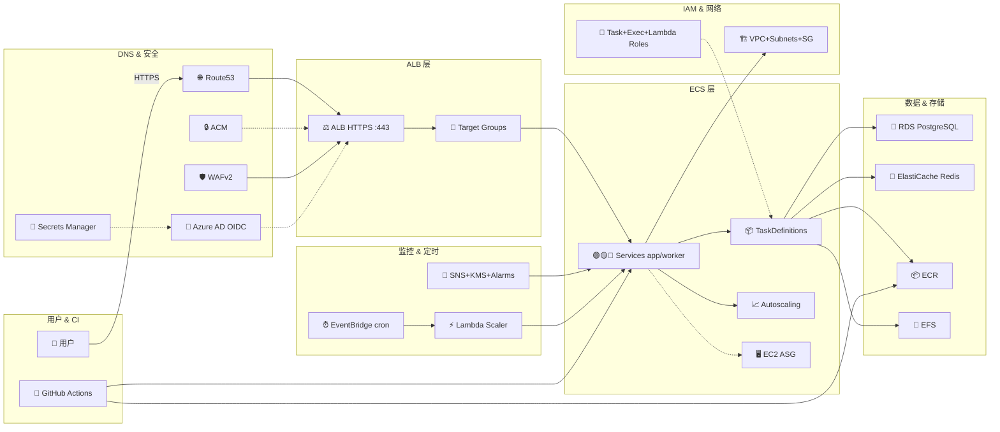

# 旧项目架构（压缩版，可在 mermaid.live 渲染）

## 旧项目全量服务清单（55 个）

| 类别 | 服务 | 是否必要 |
|------|------|----------|
| DNS | Route53 Hosted Zone, A Records×2, NS Delegation, ACM×3 | ❌ Bayer 域名绑定 |
| 安全 | WAFv2, Azure AD OIDC, Secrets Manager (OIDC) | ❌ Langfuse 自带鉴权 |
| ALB | ALB (外部模块), Target Groups×N, HTTPS Listener, Listener Rules | ⚠️ 部分可复用 |
| ECS | Cluster, Services×N, TaskDefs×N, Autoscaling | ✅ 核心（需改架构） |
| EC2 | LaunchTemplate, ASG, AMI, KeyPair | ❌ Fargate 替代 |
| ECR | ECR Repository | ⚠️ 可选 |
| EFS | FileSystem, AccessPoint, MountTarget×2, BackupPolicy | ✅ 需要 |
| RDS | Instance, SubnetGroup, ParameterGroup, Password, SnapshotID | ✅ 改为 Aurora |
| Redis | Cluster, SubnetGroup | ✅ 需要 |
| SG | ECS SG, EFS SG, ECS Egress, RDS SG, Redis SG | ✅ 精简 |
| IAM | TaskRole, ExecutionRole, LambdaRole, SchedulerRole | ✅ 精简 |
| SNS/KMS | SNS Topic, KMS Key, Email Subscription | ❌ 过度设计 |
| CloudWatch | Log Groups×2, Alarms×3 | ⚠️ 精简 |
| EventBridge | Shutdown/Start Schedulers, Lambda Scaler, Lambda Permission | ❌ 定时关停无意义 |
| GitHub | 6 Workflows (Build/Plan/Deploy/Destroy/Check/Findings) | ❌ 本地 apply 足够 |

> ✅ = 保留（需改造）| ⚠️ = 可保留但非必需 | ❌ = 过度设计/Bayer专属
