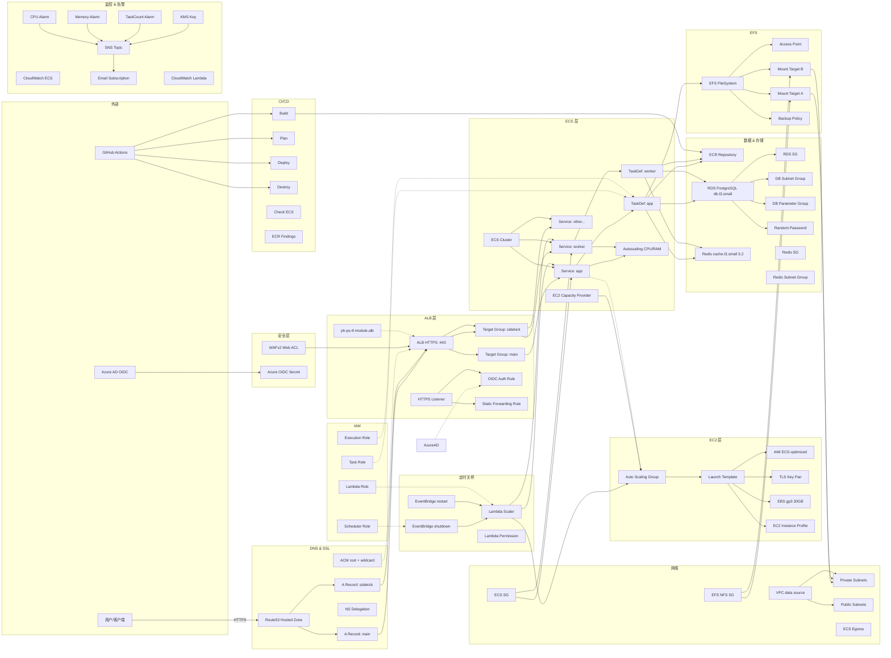

# 旧项目完整架构（Bayer Langfuse Platform — 所有服务）

## 服务统计（55 个）

| 类别 | 数量 | 服务 |
|------|------|------|
| 外部/DNS/SSL | 8 | User, AzureAD, GitHub, Route53×4, ACM |
| 安全 | 2 | WAF, OIDC Secret |
| ALB | 7 | ALB Module, ALB, Listener, TG×2, Rules×2 |
| ECS | 8 | Cluster, Services×3, TaskDefs×2, Autoscale, CapacityProvider |
| EC2 | 6 | LT, ASG, AMI, KP, EBS, InstanceProfile |
| 数据/存储 | 9 | ECR, RDS×5, Redis×3 |
| EFS | 5 | FS, AP, MT×2, Backup |
| 网络 | 6 | VPC, Private/Public, ECS SG, Egress, EFS SG |
| IAM | 4 | TaskRole, ExecRole, LambdaRole, SchedulerRole |
| 监控 | 8 | Log×2, Alarm×3, KMS, SNS, Email |
| 定时 | 4 | EventBridge×2, Lambda×2 |
| CI/CD | 6 | Build, Plan, Deploy, Destroy, Check, ECR Findings |
| **合计** | **~55** | |
