# 旧项目架构分析（红色 = Langfuse 不需要的服务）

```mermaid
graph TB
    subgraph "外部"
        USER[用户/客户端]
        AZUREAD[Azure AD / Entra ID]
        GITHUB[GitHub Actions]
    end

    subgraph "Route53"
        R53[Route53 Public Hosted Zone]
        R53_RECORD_MAIN["A Record: langfuse.{domain}"]
        R53_RECORD_SIDEKICK["A Record: {container}.langfuse.{domain}"]
        R53_NS[NS Delegation Records]
    end

    subgraph "ACM"
        ACM_ROOT[ACM Certificate: root]
        ACM_WILDCARD[ACM Certificate: *.subdomain]
        ACM_VALIDATION[Certificate Validation]
    end

    subgraph "ALB 外部模块"
        ALB_MOD["ph-ps-tf-module-alb<br/>GitHub v3.0.4"]
        WAF[WAFv2 Web ACL]
    end

    subgraph "ALB 层"
        ALB[Application Load Balancer<br/>HTTPS:443]
        TG_MAIN[Target Group: main]
        TG_SIDEKICK["Target Group: sidekick"]
        LISTENER[HTTPS Listener :443]
        OIDC_RULE[Listener Rule: OIDC]
        SIDEKICK_RULE[Listener Rule: Static Forwarding]
    end

    subgraph "ECS Cluster"
        ECS_CLUSTER[ECS Cluster]
        ECS_SERVICE_APP[ECS Service: app]
        ECS_SERVICE_WORKER[ECS Service: worker]
        ECS_SERVICE_OTHER["ECS Service: ..."]
        ECS_TD_APP[Task Definition: app]
        ECS_TD_WORKER[Task Definition: worker]
        ECS_AUTOSCALE[App Autoscaling]
        CAPACITY_PROVIDER[EC2 Capacity Provider]
    end

    subgraph "EC2 层"
        LAUNCH_TEMPLATE[Launch Template]
        ASG[Auto Scaling Group]
        AMI[AMI Data Source]
        KEYPAIR[TLS + EC2 Key Pair]
        EBS[EBS gp3 30GB]
        INSTANCE_PROFILE[EC2 Instance Profile]
    end

    subgraph "ECR"
        ECR_REPO[ECR Repository]
    end

    subgraph "EFS"
        EFS_FS[EFS File System]
        EFS_AP[EFS Access Point]
        EFS_MT_1[EFS Mount Target 0]
        EFS_MT_2[EFS Mount Target 1]
        EFS_BACKUP[EFS Backup Policy]
    end

    subgraph "RDS 传统 PostgreSQL"
        RDS_MOD[RDS Module]
        RDS_INSTANCE[aws_db_instance<br/>db.t3.small]
        RDS_SG[RDS Security Group]
        RDS_SUBNET[DB Subnet Group]
        RDS_PARAM[DB Parameter Group]
        RDS_PASSWORD[Random Password]
        RDS_SNAPSHOT_ID[Random Snapshot ID]
    end

    subgraph "ElastiCache"
        REDIS[Redis Cluster<br/>cache.t3.small / 3.2.10]
        REDIS_SG[Redis Security Group]
        REDIS_SUBNET[Redis Subnet Group]
    end

    subgraph "VPC Data Source"
        VPC["data.aws_vpc"]
        PRIVATE_SUBNETS["data.aws_subnets: Private"]
        PUBLIC_SUBNETS["data.aws_subnets: Public"]
    end

    subgraph "Security Groups"
        ECS_SG[ECS Service SG]
        ECS_SG_EGRESS[ECS Egress Rules]
        EFS_SG[EFS NFS SG]
    end

    subgraph "IAM"
        TASK_ROLE[ECS Task Role<br/>含 Athena/Glue/Timestream/STS]
        EXEC_ROLE[ECS Execution Role]
        LAMBDA_ROLE[Lambda Scheduler Role]
        SCHEDULER_ROLE[EventBridge Scheduler Role]
    end

    subgraph "Secrets Manager"
        SECRET[Azure AD OIDC Secret]
    end

    subgraph "SNS + KMS"
        KMS_KEY[KMS Key for SNS]
        SNS_TOPIC[SNS Topic: ecs-alerts]
        SNS_EMAIL[SNS Email Subscription]
    end

    subgraph "CloudWatch"
        LOG_ECS[Log Group: ECS]
        LOG_LAMBDA[Log Group: Lambda]
        ALARM_CPU[CPU Alarm]
        ALARM_RAM[Memory Alarm]
        ALARM_COUNT[Task Count Alarm]
    end

    subgraph "EventBridge + Lambda"
        SCHEDULER_SHUT[EventBridge: shutdown cron]
        SCHEDULER_START[EventBridge: restart cron]
        LAMBDA_SCALER[Lambda scaler<br/>set desired=0/restore]
        LAMBDA_PERM[Lambda Permission]
    end

    subgraph "CI/CD GitHub Actions"
        BUILD[Build Workflow]
        PLAN[Plan on PR]
        DEPLOY[Deploy Workflow]
        DESTROY[Destroy Workflow]
        CHECK_ECS[Check ECS Status]
        ECR_FINDINGS[Summarize ECR Findings]
    end

    %% === 标记不需要的服务 ===
    classDef unnecessary fill:#ff6b6b,stroke:#c92a2a,color:#fff,stroke-width:2px
    classDef keep fill:#51cf66,stroke:#2f9e44,color:#fff

    class AZUREAD,WAF,OIDC_RULE,SIDEKICK_RULE,R53_NS,R53_RECORD_SIDEKICK,ACM_ROOT,ACM_WILDCARD,ACM_VALIDATION,ALB_MOD,CAPACITY_PROVIDER unnecessary
    class LAUNCH_TEMPLATE,ASG,AMI,KEYPAIR,EBS,INSTANCE_PROFILE,EC2_CAPACITY unnecessary
    class ECS_SERVICE_OTHER,ECS_SERVICE_WORKER unnecessary
    class KMS_KEY,SNS_TOPIC,SNS_EMAIL,ALARM_CPU,ALARM_RAM,ALARM_COUNT unnecessary
    class SCHEDULER_SHUT,SCHEDULER_START,LAMBDA_SCALER,LAMBDA_PERM,LAMBDA_ROLE,SCHEDULER_ROLE,LOG_LAMBDA unnecessary
    class SECRET,ECS_AUTOSCALE unnecessary
    class RDS_SNAPSHOT_ID,RDS_PARAM unnecessary
    class BUILD,PLAN,DEPLOY,DESTROY,CHECK_ECS,ECR_FINDINGS,GITHUB unnecessary
    class TASK_ROLE unnecessary
```

## 图例

| 颜色 | 含义 |
|------|------|
| 红色 | Langfuse 不需要，过度设计 / Vendor-lock |
| 绿色 | Langfuse 需要的核心服务 |

## 不需要的服务详解（按删除优先级）

### 优先级 1 — 完全多余（可直接删）

| 服务 | 原因 |
|------|------|
| **EC2 全部** (Launch Template, ASG, AMI, Key Pair, Instance Profile) | Langfuse 用 Fargate Serverless 即可，不需要管理 EC2 |
| **EC2 Capacity Provider** | 同上 |
| **EventBridge Scheduler ×2** | 定时关停/重启 LLM 观测平台没意义，需 24/7 运行 |
| **Lambda Scaler** | 为定时关停服务的，连带删除 |
| **Lambda Role + Scheduler Role** | 同上 |
| **Lambda Log Group** | 同上 |

### 优先级 2 — 过度设计（B2B 特需）

| 服务 | 原因 |
|------|------|
| **SNS Topic + KMS Key** | 告警可直接用 CloudWatch + Slack webhook，不需 SNS/KMS 链路 |
| **CloudWatch Alarms ×3** | 过度精细，Langfuse 自带的健康检查端点已够 |
| **App Autoscaling** | Langfuse 任务本身有 3 容器共置，扩缩容 ECS Service 即可 |

### 优先级 3 — 企业环境特需

| 服务 | 原因 |
|------|------|
| **Azure AD OIDC** | Langfuse 自带邮件+密码认证，不需要外部 SSO |
| **Secrets Manager (Azure AD)** | 同上 |
| **WAFv2 Web ACL** | HTTP 场景不需要，Langfuse API key 已有鉴权 |
| **Route53 + ACM** | HTTP-only 部署不需要域名和证书 |
| **ALB 外部模块 (ph-ps-tf-module-alb)** | 多一层抽象，实际 ALB 配置很简单，原生 resource 即可 |

### 优先级 4 — Bayer-specifc 硬编码

| 服务 | 原因 |
|------|------|
| **VPC Data Source (按 tag 查)** | 依赖特定标签格式 `tag:environment` |
| **RDS Security Group (按环境硬编码)** | `hosting.tf:52-54` 直接写死 subnet-xxx 和 sg-xxx |
| **ALB 白名单 12 个 NAT Gateway IP** | Bayer 全球内网 IP，非通用 |
| **CI/CD 全部 6 个 Workflow** | 项目不需要 GitHub Actions，本地 apply 即可 |
| **OIDC Issuer (硬编码 Tenant ID)** | `fcb2b37b-5da0-466b-9b83-0014b67a7c78` 是 Bayer 的 Tenant |

### 核心保留（约 30% 的服务）

| 服务 | 在新项目中对应 |
|------|---------------|
| ALB | 原生 aws_lb (HTTP:80) |
| ECS Cluster | 原生 aws_ecs_cluster |
| ECS Service ×1 | 1 个 Service 含 3 容器 |
| ECS Task Definition | 1 个 TaskDef 含 3 容器定义 |
| ECR | 直接拉 Docker Hub 或可选 ECR |
| EFS | 原生 aws_efs_* |
| RDS | Aurora Serverless v2 替代传统 RDS |
| Redis | ElastiCache Serverless 或 cluster mode |
| ECS SG + EFS SG | 原生 aws_security_group |
| IAM (Task + Execution) | 精简版原生 policy |
| CloudWatch Log Group | 原生 aws_cloudwatch_log_group |
| Secrets Manager | 新版用 1 个 Secret 存所有密码 |
| S3 | 原生 aws_s3_bucket (新版新增) |
