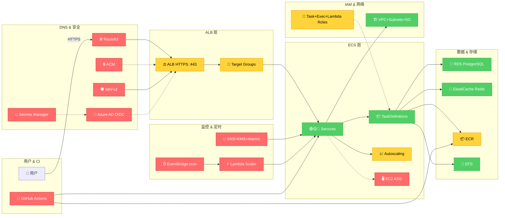

# 旧项目架构（标注版 — 红/黄/绿）

## 图例

| 颜色 | 含义 | 数量 | 服务 |
|------|------|------|------|
| 🟢 绿色 | **保留** （需改造） | 6 | ECS Services, TaskDefs, RDS, Redis, EFS, Network |
| 🟡 黄色 | **可复用但需改造** | 5 | ALB, Target Groups, Autoscaling, ECR, IAM |
| 🔴 红色 | **过度设计 / Bayer 专属** | 11 | Route53, ACM, WAF, Azure AD, Secrets(OIDC), EC2, SNS+KMS+Alarms, EventBridge, Lambda, GitHub Actions |

## 红色服务删除原因

| 服务 | 原因 |
|------|------|
| Route53 + ACM | HTTP-only 部署不需要域名和证书 |
| WAFv2 | Langfuse API Key 已有鉴权 |
| Azure AD OIDC | Langfuse 自带认证 |
| Secrets Manager (OIDC) | 仅存 Azure AD 密钥，无需 |
| EC2 ASG | Fargate 替代 |
| SNS + KMS + Alarms | 过度精细，CloudWatch 直连 Slack 即可 |
| EventBridge ×2 + Lambda | LLM 观测平台需 24/7 运行，定时关停无意义 |
| GitHub Actions ×6 | `terraform apply` 本地执行足够 |
